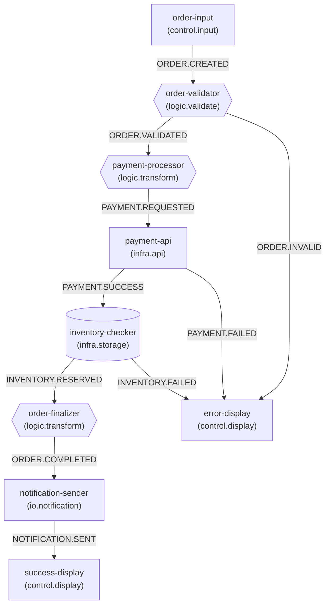

```mermaid
graph TD
  %% Nodes
  order-input["order-input<br/>(control.input)"]
  order-validator{{"order-validator<br/>(logic.validate)"}}
  payment-processor{{"payment-processor<br/>(logic.transform)"}}
  payment-api["payment-api<br/>(infra.api)"]
  inventory-checker[("inventory-checker<br/>(infra.storage)")]
  order-finalizer{{"order-finalizer<br/>(logic.transform)"}}
  notification-sender["notification-sender<br/>(io.notification)"]
  error-display["error-display<br/>(control.display)"]
  success-display["success-display<br/>(control.display)"]

  %% Wires
  order-input -->|ORDER.CREATED| order-validator
  order-validator -->|ORDER.VALIDATED| payment-processor
  order-validator -->|ORDER.INVALID| error-display
  payment-processor -->|PAYMENT.REQUESTED| payment-api
  payment-api -->|PAYMENT.SUCCESS| inventory-checker
  payment-api -->|PAYMENT.FAILED| error-display
  inventory-checker -->|INVENTORY.RESERVED| order-finalizer
  inventory-checker -->|INVENTORY.FAILED| error-display
  order-finalizer -->|ORDER.COMPLETED| notification-sender
  notification-sender -->|NOTIFICATION.SENT| success-display
```